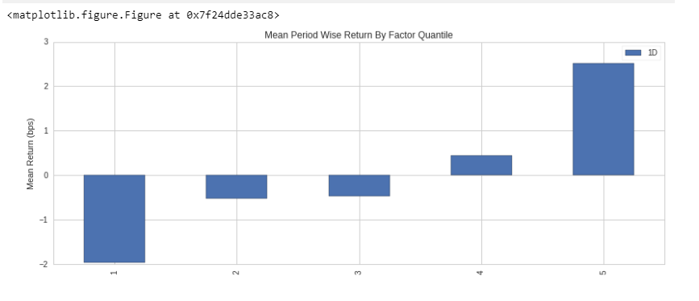

# Automated Investment System - 2

## Purpose
The goal is to test and implement quantitative strategies aimed toward maximal risk-adjusted returns in the least amount of time possible. 

## Business Significance
    - Saves time by using a simpler process going from research to execution
    - Saves time and increases probability of returns by allowing researchers and traders to focus on iterating on their talent opposed to spending time on development and data prep
    - Gives independent quantitative traders the ability to invest/trade on their own.
    
## Costs
    - Time spent on factor research
    - Time spent building algorithms
    - Time spent translating quantopian algorithms to a format that can be executed in Alpaca
    - Normal costs of investing, all the tools involved are free 

## Process
1. Quantitative Research Notebook in Quantopian
2. Backtest Pipeline/Algorithm 
3. Translate quantopian algorithm to pylivetrader
4. Connect Alpaca account to algorithm
5. Run algorithm in command Line
6. Monitor Results on Alpaca Interface

## Repository Introduction
This GitHub repository contains the code for an algorithm that can be used in quantopian. The returns in the algorithm in its current state are not as optimal as possible, but the structure for an investment strategy that involves both longs and shorts that is done with technical analysis of common financial metrics is there to be modified according to the desired positions of the user. Using simple metrics like :- Closing Price, Simple Moving Average, and Historical Returns, we were able to outperform "common returns" on Quantopian, which means that we were able to outperform others who were using these same "factors" in their algorithms. In the future, this can be expanded upon to use much more complicated analysis, as well as optimized with machine learning. 

Additionally, designed this to be compatible with Alpaca, a trading platform that allows you to use Python/Quantopian/Pandas to create automated trading strategies. This was done with pyvlivetrading to help make the transition as smooth as possible to Alpaca. While our Quantopian algorythm executes weekly, the Alpaca one is set to run daily to demonstrate its capabilities. 

## Code

*  In the Algo Folder:
  
    * long_short_algo is a simple "Long/Short" strategy that can be used in Quantopian, for testing/research purposes.
    
    * Project1Final is the backtesting code in Quantopian.
    
    * Algo_Final_Pylivetrader is the final code for the algorithm as used in Alpaca. Implemented daily rather than weekly. 

We followed these steps in order to create the algorythm and then move it over to Alpaca. 

## Alpaca Implementation
### Setup Requirements
*  Python 3.6 and the Pylivetrader package 
(*Pylivetrader is Python's live algorithm implementation package necessary for translating Quantopian libraries for live and paper trading via Alpaca*)
* Pylivetrader can be installed one of two ways (and must be installed in Python v3.6):
1. Pyenv and virtualenv (for Mac users) installation and steps necesssary to activate a virtual environment in Python3.6. Further documentation found here: https://github.com/pyenv/pyenv-virtualenv/blob/master/README.md
2. Anaconda (note that any work done in an Anaconda environment requires code to be copied and pasted into a fresh .py via VS Code or the like in order to run algorithms via the command line)
* Alpaca account registration and API keys
### Quantopian to Pylivetrader Translation
* Quick link to Quantopian to Alpac migration documentation found here: https://github.com/alpacahq/pylivetrader/blob/master/migration.md
* Additional Call-outs:
1. Quantopian code is developed in Python 2 but offers a simple one-click solution to 3.5 within the UI prior to copying into an external Python file
2. Quantopian optimize functions are not readily mimicked in external Python environments
3. Alpaca uses Polygon as their fundamental data source so additional translation from Quantopian's Morningstar to Polygon must be performed and as of 6.17.20 requires a funded Alpaca account even for Paper simulation
* Example Visual of Package translation from Quantopian to Pylivetrader

* External environments will often not kick back code errors so as a best practice, ensure your translated code runs back within the Quantopian environment to ensure execution when running in a live or paper environment via Alpaca
* Note that Blueshift (https://blueshift.quantinsti.com/) offers a considerably more turnkey path to execution via Alpaca but a trimmed down data provider and research offering relative to Quantopian
### Algorithm Launch
* Running from the command line instructions found here: https://github.com/alpacahq/pylivetrader/blob/master/README.md and additional troubleshooting issues found here: https://github.com/alpacahq/pylivetrader/issues
* As of 6.17.20, Pylivetrader must be restarted at least once every 24 hours but I found that to be considerably more frequently for this exercise
* There's currently no clean way to parse out multiple algorithms running concurrently within the Alpaca UI
